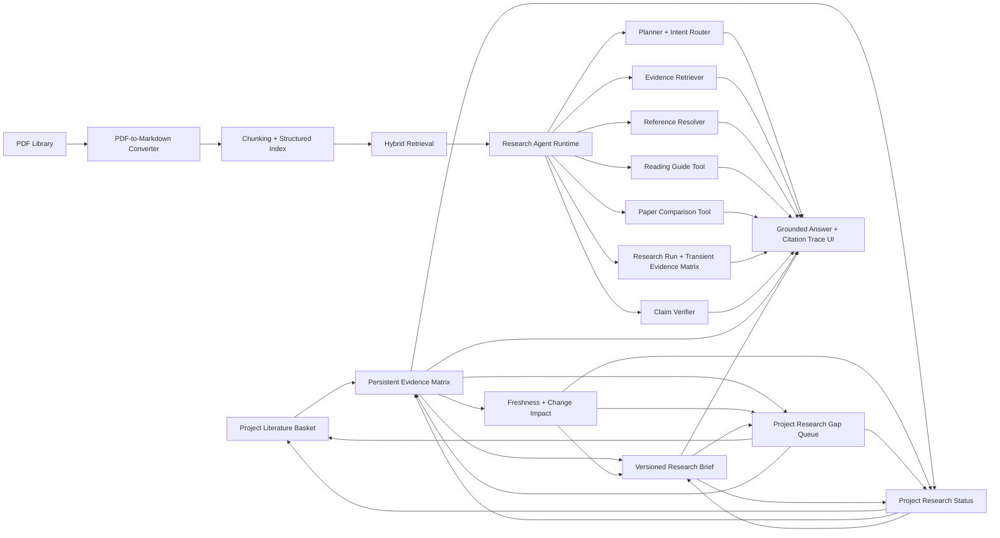

# Pi_zaya

Pi_zaya is a local-first, evidence-grounded research agent for academic PDFs. It
helps users read papers, retrieve evidence, trace citations, compare papers,
generate verifiable answers, turn a project's literature basket into a
persistent cell-level evidence matrix, and create an editable research brief
from the verified matrix. A project research gap queue then turns audited
missing evidence and stale dependencies into an impact-ranked, human-reviewed
worklist. A project research status center then measures the complete structured
workflow and routes the researcher to exactly one quality-first next action.

This is a production-oriented AI agent / RAG engineering portfolio project, not
a toy PDF chatbot. It connects PDF conversion, structured indexing, hybrid
retrieval, agent planning, tool execution, claim verification, citation cards,
and a React trace UI into one end-to-end research workflow.

The product entry is FastAPI + React. The legacy Streamlit entry has been
removed; do not use `app.py`, `streamlit run`, or port `8501` as the product
entry.

## Downloadable Windows beta

The current release engineering target is `v0.1.0-beta.2`: a Windows x64 portable ZIP
with a bundled Python runtime and prebuilt React frontend. End users extract the
ZIP and run `Start-Pi-zaya.cmd`; Node.js and system Python are not required.
User databases, PDFs, converted Markdown, preferences, backups, and logs live
under `%LOCALAPPDATA%\Pi_zaya`, so replacing the application folder preserves
the library. See `docs/RELEASE_RUNBOOK.md` for build, smoke, checksum, and
clean-machine acceptance details.

The source is available under the MIT License. No official beta artifact has
been published yet: the formal build requires a clean, versioned working tree,
and the tag workflow still has to pass before it creates a GitHub prerelease.
Background jobs also remain process-local, so the release is explicitly beta
rather than a general-availability desktop product.

## Problem

Academic PDF QA demos often fail in the places researchers care about most:

- They answer without showing which paper passage supports the claim.
- They blur paper-specific findings with general model knowledge.
- They do not expose retrieval scope, tool steps, or citation confidence.
- They treat PDF conversion, reference metadata, and answer grounding as
  separate demos instead of one workflow.

Pi_zaya is designed around the opposite constraint: if an answer claims
something about a paper, the user should be able to trace that claim back to
local evidence or see a clear disclosure that the answer used external model or
web context.

## Key Features

| Capability | What it provides |
|---|---|
| Anchored PDF conversion | Converts PDFs to Markdown while preserving page markers, sections, figures, formulas, and source anchors. |
| Evidence-based QA | Searches the indexed library, builds a RAG prompt from retrieved snippets, and returns grounded answers. |
| Citation tracing | Surfaces answer evidence, source cards, reference context, and reader locate targets. |
| Literature basket | Lets users collect papers and excerpts, keep local research context, and export citations. |
| Evidence matrices | Builds project-scoped, versioned comparisons of methods, experiments, metrics, results, and limitations; every populated factual cell opens its exact local source evidence, while unavailable facts remain empty. A persistent change inbox fingerprints full text separately from metadata, reports downstream row/comparison/brief/citation impact, blocks stale indexes, and refreshes only user-confirmed affected sources while preserving unaffected evidence. A high-precision candidate scan can prefill paired comparison contracts from structured metric tables, but requires human confirmation of every semantic mapping and a fresh server-side strict audit before producing any result. Explicit paired audits produce a result only after task, dataset, protocol, metric, target, value, and both source excerpts pass the comparison contract. Exports Markdown, CSV, or XLSX. |
| Research briefs | Generates project-scoped, versioned Markdown briefs only from a selected verified evidence matrix, audits every substantive claim, distinguishes historically verified snapshots from the latest matrix state, and turns changed fields/citations into a reviewable incremental update. Users accept or keep each affected claim, unaffected Markdown remains byte-for-byte intact, and the merged revision receives a complete evidence audit before export. |
| Research gap queue | Aggregates explicit missing/unsupported matrix cells, non-comparable audits, stale brief lineage, and source changes into a deterministic project worklist. It reports downstream matrix/brief/citation/comparison impact. A same-source repair path can propose exact, locatable sentences from the matrix row's own freshly indexed paper. Cross-paper discovery uses a separate two-stage review: first confirm the candidate into the literature basket, then inspect a full extractive row preview before adding that paper as a new matrix source. Neither path can attribute another paper's evidence to the original row. |
| Project research status | Measures source freshness, matrix verification, evidence gaps, complete comparison-candidate coverage, and brief lineage, then exposes exactly one deterministic next action. Changed sources and evidence defects always outrank comparison review or export. The center shows scan coverage and phase timings and navigates directly to the affected workflow without accepting evidence or comparison conclusions. |
| Research Agent Mode | Adds explicit planning, source policy, evidence matrix, tool-use trace, and sentence-level citation support checks on top of the existing RAG flow. |
| Quality tooling | Scans conversion quality, runs repair flows, rebuilds indexes, and tracks metadata/reference sync. |

## Architecture



At a high level:

1. PDFs are converted into anchored Markdown with page markers and source
   locations.
2. Markdown is chunked and indexed for retrieval, references, figures, and
   reader navigation.
3. Retrieval returns candidate evidence under the current-paper, basket, or full
   library scope.
4. Research Agent Mode plans tool calls, checks evidence sufficiency, generates
   an answer, and verifies citation support.
5. A project can turn selected literature-basket sources into a persistent,
   versioned evidence matrix. Each populated factual cell is an extract from the
   same paper and carries a reader locator; missing evidence stays visibly empty.
6. A verified matrix can generate a versioned brief using only its audited
   evidence. The same claim verifier blocks unsupported, unresolved,
   missing-source, or out-of-scope evidence from receiving verified status.
7. When the matrix advances, the brief preserves its historical audit while a
   lineage check reports whether evidence is equivalent or identifies changed
   fields and affected citations. A persisted update plan rewrites only the
   affected citation-bearing blocks, shows the old/proposed Markdown, and lets
   the user accept or retain each block. Unaffected content is not regenerated.
   The merged revision stays bound to the same matrix and reruns the complete
   audit; retained stale blocks force `needs_review`, while unverifiable lineage
   blocks the operation or export.
8. The frontend keeps the answer clean while citations, reference cards, reader
   locate targets, and agent traces remain inspectable on demand.
9. The project research gap queue reuses structured matrix, comparison, brief,
   and source-change facts to prioritize unresolved evidence work. Cell gaps
   first offer strict same-paper repair candidates; accepting an exact passage
   creates a new matrix revision, reruns matrix/comparison audits, and exposes
   affected briefs to the existing incremental review flow. Cross-paper
   candidates exclude current matrix sources and require explicit basket
   confirmation. A second confirmation can add the selected paper as an
   independently grounded row after previewing every extracted or honestly
   missing field; existing rows remain unchanged and affected briefs return to
   the incremental review flow.
10. A verified matrix can scan structured metric tables for high-precision
    comparison candidates. The UI shows both exact source excerpts and every
    prefilled task, dataset, protocol, metric, target, and result. Controlled
    exact matches are visible, semantic mappings require an explicit checkbox,
    and the server recomputes the candidate before running the unchanged strict
    comparison audit. Only that audited revision can refresh research gaps or
    brief lineage.
11. The project research status center refreshes source/gap state, measures
    comparison-candidate coverage across every eligible current matrix, and
    returns one fixed quality-first action. It can route to the exact matrix,
    comparison tab, gap queue, brief, or literature basket, but cannot resolve
    any evidence contract on the researcher's behalf.

Key backend entry points:

- `api/main.py`: FastAPI application
- `api/routers/generate.py`: streaming chat generation
- `api/routers/chat.py`: conversations, messages, uploads, and direct research-agent endpoint
- `api/routers/library.py`: library, conversion, quality, metadata, and indexing APIs
- `api/routers/evidence_matrices.py`: project evidence-matrix generation, revisions, cell audit, and export
- `api/routers/research_briefs.py`: project brief generation, revisions, evidence audit, and export
- `api/routers/research_gaps.py`: project gap aggregation, same-source cell repair, cross-source candidate search, and human confirmation
- `kb/task_runtime.py`: background generation/conversion runtime
- `kb/evidence_matrix.py`: source-balanced cell extraction, strict same-source repair, comparison boundaries, audit, and exporters
- `kb/research_brief.py`: brief source normalization, quality contract, bibliography, and exporters
- `kb/research_brief_lineage.py`: matrix fingerprinting, freshness, change impact, and export provenance rules
- `kb/research_brief_update.py`: stable citation slots, affected-block planning, grounded candidate synthesis, exact-span merge, and preservation metrics
- `kb/research_gap.py`: deterministic gap identity, priority, impact, and local candidate evidence search
- `kb/project_status.py`: deterministic project readiness stages and unique next-action priority
- `kb/agent/`: lightweight Research Agent layer

Key frontend entry points:

- `web/src/main.tsx`: React entry
- `web/src/pages/ChatPage.tsx`: main chat workspace
- `web/src/pages/LibraryPage.tsx`: PDF/library workspace
- `web/src/components/chat/AgentTracePanel.tsx`: Research Agent trace UI
- `web/src/components/chat/CiteShelf.tsx`: literature basket UI
- `web/src/components/chat/EvidenceMatrixWorkspace.tsx`: persistent matrix editor, evidence, versions, and exports
- `web/src/components/chat/ResearchBriefWorkspace.tsx`: brief editor, preview, evidence, versions, and exports
- `web/src/components/chat/ProjectActionCenter.tsx`: measured project status, single next action, and exact workflow navigation
- `web/src/api/*.ts`: typed API contracts

## Research Agent Mode

Research Agent Mode is an incremental layer over the existing RAG system. It does
not replace retrieval, prompt building, citation cards, or the default chat flow.
When enabled, a response includes an `agent_trace` object with:

- `question_type`: `single_paper_qa`, `multi_paper_comparison`, `reading_guide`, `reference_followup`, or `unknown`
- `context.planner_intent`: typed planner output with task type, required tools,
  evidence need, target-paper hints, and planner confidence
- `context`: effective query scope, requested scope, current-paper lock, and selected-basket count when available
- `summary`: compact audit fields for claim support, scope, tool-call count, and error presence
- `research_run`: compact run metadata with source policy, subtask summary, and
  evidence-matrix rows for paper, method, result, limitation, quote, and support status
- `plan`: planned steps with goal, tool, and status
- `steps`: executed tool calls, observations, compact outputs, and errors
- `verification`: sentence-level citation/evidence support counts, `evidence_status`
  (`grounded`, `needs_review`, `insufficient`, or `not_applicable`), unsupported-claim reasons, and
  compact matched evidence sources

For reference-followup answers, resolved upstream references in the trace can be
opened in the reader or added to the literature basket from the chat UI.
For comparison and evidence-heavy answers, the trace can include a compact
evidence matrix so reviewers can scan which source supports which method,
result, or limitation without exposing raw tool logs in the main answer. The
same matrix is also attached to the pre-answer structured notes, so answer
generation can synthesize from the paper/method/result/limitation/evidence cells
instead of treating the matrix as UI-only audit metadata.
Historical agent traces can also be read through the compact audit endpoint
`GET /api/messages/{message_id}/agent-trace`. The React UI keeps this as a
collapsed, on-demand trace panel so ordinary answers are not crowded with
planning or tool-log details.
When opened, the panel shows the compact summary first; plan and tool-call logs
stay behind a second "Execution Details" disclosure.
When collapsed, the panel only shows compact evidence-check status and scope, not
raw question-type labels or tool execution logs.
Agent Mode also applies a lightweight evidence gate: answers with retrieved
local evidence keep local snippets as the authority, while the model may add
compact external academic background to improve framing. If OpenAI web search is
configured, that background can use API web search; otherwise it comes from the
normal text model. No-hit academic questions can also fall back to an external
model answer. External fallback and hybrid answers are visibly marked so users
can tell which claims are knowledge-base grounded and which parts are model/web
background; no-hit fallback uses `not_applicable` for local citation
verification.
The source blend is explicit in the trace: `local_grounded`,
`hybrid_local_external`, `external_academic`, or `general_llm`. General
non-library questions can use the normal text API without adding a knowledge-base
miss notice to the answer.
After generation, a lightweight answer-quality gate checks citation presence,
source disclosure, evidence overlap, and trace/debug leakage. If the answer
fails, the runtime makes one repair attempt; if it still cannot pass, it returns
a conservative evidence-only summary instead of exposing unsupported claims.
The main answer body is kept focused on the response and necessary citations in
rendered UI, API streaming, and stored chat messages; trace JSON, plan steps,
tool calls, and verification details remain behind the trace panel.

The planner uses simple heuristics first:

- comparison keywords -> `multi_paper_comparison`
- "how to read" / reading-guide language -> `reading_guide`
- reference, citation, upstream, prior-work language -> `reference_followup`
- otherwise -> `single_paper_qa`

The runtime then applies an evidence sufficiency gate. Low-confidence retrieval
hits are preserved in the trace for diagnosis, but only usable hits are treated
as local evidence. If the local library is insufficient, the answer is qualified
or routed to an external academic fallback when configured; it is not presented
as a knowledge-base-grounded result.

The tool layer wraps existing modules instead of adding external services:

- `retrieve_evidence`
- `retrieve_references`, which reads the local reference index when available and returns compact upstream-reference fields such as `ref_num`, `title`, `authors`, `year`, `doi`, `source_paper`, and `why_relevant`
- `build_reading_guide`
- `compare_papers`, which returns source-specific `paper`, `method`, `evidence`, `limitation`, and `relation_to_question` fields
- `generate_grounded_answer`
- `verify_answer_citations`

If no text LLM API key is configured, the agent still runs in degraded mode and
returns retrieved evidence notes plus a trace instead of crashing the app.

### Enable Agent Mode

In the React chat UI, toggle the `Normal` / `Agent` button in the composer before
sending a question. The setting is persisted per conversation and only affects
newly sent turns, so ordinary chat stays unchanged unless the user explicitly
enables Agent Mode. For explicit test or deep-link entry, open the app with
`/?agent_mode=1`.

API options:

```http
POST /api/generate
Content-Type: application/json

{
  "conv_id": "conversation-id",
  "prompt": "Compare these papers",
  "agent_mode": true,
  "query_scope": "basket",
  "prompt_context": {
    "items": [
      {"title": "Paper A", "sourcePath": "paper-a.md"}
    ]
  }
}
```

Direct non-conversation endpoint:

```http
POST /api/chat/research-agent
Content-Type: application/json

{
  "query": "How should I read this paper?",
  "top_k": 6,
  "query_scope": "current_paper",
  "source_lock_path": "converted-paper.md"
}
```

Supported `query_scope` values are `current_paper`, `basket`, and `library`.
Default chat behavior is unchanged when `agent_mode` is omitted or false.

## Quick Start

Requirements:

- Python `3.10.11` as declared in `.python-version`
- Node.js `24.13.0` as declared in `.nvmrc`
- At least one text LLM key for full answers: `QWEN_API_KEY`, `DEEPSEEK_API_KEY`, or `OPENAI_API_KEY`

Install:

```powershell
Copy-Item .env.example .env

python -m venv .venv
.\.venv\Scripts\Activate.ps1
pip install -r requirements.txt

cd web
npm ci
cd ..
```

Run the development UI and API:

```powershell
.\run_new.ps1 -StopExisting
```

Equivalent wrapper:

```powershell
.\run.ps1 -StopExisting
```

Primary local URLs:

- React app: `http://127.0.0.1:5173/`
- FastAPI backend: `http://127.0.0.1:8000/`

Run backend only:

```powershell
python -m uvicorn api.main:app --host 127.0.0.1 --port 8000 --reload
```

Run frontend only:

```powershell
cd web
npm run dev -- --host 127.0.0.1 --port 5173
```

Build frontend:

```powershell
cd web
npm run build
```

Single-service local production mode:

```powershell
cd web
npm run build
cd ..
python server.py
```

## Production Deployment

For public deployments, keep user-facing login disabled while protecting management writes:

Set `KB_PRIVATE_INSTANCE_AUTH=0`, `KB_ENABLE_AUTH_GATE=0`, and
`KB_REQUIRE_AUTH=0` so ordinary users can open the app without an access token.
Set `KB_REQUIRE_MANAGEMENT_AUTH=1` and configure
`KB_MANAGEMENT_ACCESS_TOKEN` or `KB_MANAGEMENT_ACCESS_TOKEN_SHA256` so settings,
uploads, library changes, conversion, and reindex operations require the owner
token. The Settings drawer contains the management unlock control.

Chinese deployment note: 面向普通用户的公开部署保持 `KB_PRIVATE_INSTANCE_AUTH=0`、`KB_ENABLE_AUTH_GATE=0` 和 `KB_REQUIRE_AUTH=0`，用户打开应用不需要访问令牌；同时设置 `KB_REQUIRE_MANAGEMENT_AUTH=1` 与管理令牌，设置、上传、文献库修改、转换和重建索引需要管理员解锁。

Use private/internal auth only for controlled instances, and configure
`KB_ACCESS_TOKEN` or `KB_ACCESS_TOKEN_SHA256` when auth is enabled.

Run the production readiness check after startup:

```powershell
python tools\check_production_readiness.py --base-url http://127.0.0.1:8000
```

## Configuration

Common environment variables:

- `QWEN_API_KEY`, `DEEPSEEK_API_KEY`, or `OPENAI_API_KEY`: text model access
- `QWEN_BASE_URL`, `DEEPSEEK_BASE_URL`, `OPENAI_BASE_URL`: optional provider base URLs
- `QWEN_TEXT_MODEL`, `QWEN_VISION_MODEL`: separate Qwen text and PDF-conversion model names
- `QWEN_MODEL`, `DEEPSEEK_MODEL`, `OPENAI_MODEL`: optional legacy/shared model names (`QWEN_MODEL` remains a backward-compatible override)
- `KB_AGENT_WEB_SEARCH_ENABLED`: enable or disable no-hit academic web fallback
- `KB_AGENT_WEB_SEARCH_API_KEY`: optional OpenAI-compatible web-search key; falls back to `OPENAI_API_KEY`
- `KB_AGENT_WEB_SEARCH_MODEL`: web-search model, default `gpt-5-search-api`
- `KB_PDF_DIR`: source PDF directory
- `KB_MD_DIR`: converted Markdown directory
- `KB_DB_DIR`: retrieval/index directory
- `KB_CHAT_DB`: chat SQLite path
- `KB_LIBRARY_DB`: library SQLite path
- `KB_CROSSREF_BUDGET_S`: Crossref sync time budget

For local development, copy the development environment template:

```powershell
Copy-Item .env.example .env
```

Copy the production environment template only for production-style deployment:

```powershell
Copy-Item .env.production.example .env
```

The settings UI can also store local API preferences in `user_prefs.json`.
Environment variables and `.env` values take precedence.

## Typical Workflow

1. Open the Library page.
2. Upload or select PDFs.
3. Convert PDFs to Markdown.
4. Review conversion quality and run repair/reconversion when needed.
5. Rebuild the knowledge base indexes.
6. Ask questions from the current paper, selected literature basket, or full library.
7. Open answer evidence/citation cards in the Reader.
8. Add important papers to a project literature basket, generate and review its
   evidence matrix, and keep honest gaps empty.
9. Create a verified research brief from the audited matrix. If the matrix
   changes, review the displayed affected fields/citations and update the bound
   brief from the latest verified revision before treating it as current.
10. Export the brief with its lineage marker, or export the matrix as Markdown,
    CSV, or XLSX.

## Demo

A polished demo GIF/video is not checked into the repository yet. Suggested demo
path for portfolio use:

1. Upload one or two academic PDFs.
2. Convert and index the papers.
3. Ask a paper-specific question in Agent Mode.
4. Open the citation card and reader locate target.
5. Ask a comparison or reading-guide question.
6. Open the Research Agent Trace panel to show planner intent, tool calls,
   evidence matrix, evidence status, and claim verification.

## License

Pi_zaya is licensed under the MIT License. See `LICENSE`.

## Evaluation

See [docs/EVAL_DASHBOARD.md](docs/EVAL_DASHBOARD.md) for metric categories,
manual/semi-automated evaluation tables, commands, current limitations, and
future work. The document intentionally does not include fabricated numbers.

Core evaluation dimensions:

- Retrieval Recall@k and retrieval relevance
- Citation precision and evidence locate success
- Claim support rate and unsupported claim rate
- No-evidence refusal accuracy
- Agent trace completeness, evidence-matrix coverage, and planner accuracy
- P50/P95 latency and cost per query when instrumentation is available

Metrics remain `TBD` until produced by a reproducible run or documented manual
review. The lightweight agent trace eval can write a JSON report with measured
fixture-regression fields and `null` placeholders for unmeasured live metrics
such as latency and cost.

The recorded fixture `docs/research_agent_eval_v1.jsonl` checks a small set of
answer-quality guardrails: local-evidence support, hybrid/external source
disclosure, expected answer-point coverage, and keeping trace/tool/debug content
out of the main answer. Treat these as reproducible regression checks, not as a
claimed live benchmark.

Useful commands:

```powershell
python -m pytest tests/unit -q
python -m ruff check .
python -m pytest tests/unit/test_agent_answer_runtime_e2e.py -q
python tools\research_qa\validate_research_agent_golden.py
python tools\research_qa\run_agent_trace_eval.py --json-out test_results\agent_trace_eval.json
python tools\research_qa\export_research_agent_samples.py --db chat.sqlite3 --out test_results\research_agent_answer_samples.jsonl --limit 50
python tools\research_qa\review_research_agent_samples.py prepare --samples test_results\research_agent_answer_samples.jsonl --labels test_results\research_agent_answer_labels.jsonl
python tools\research_qa\review_research_agent_samples.py merge --samples test_results\research_agent_answer_samples.jsonl --labels test_results\research_agent_answer_labels.jsonl --out test_results\research_agent_answer_reviewed.jsonl
python tools\research_qa\run_agent_trace_eval.py --real-samples test_results\research_agent_answer_samples.jsonl --json-out test_results\agent_trace_real_replay_eval.json
python tools\research_qa\run_reviewed_replay_eval.py
python tools\research_qa\run_research_qa_eval.py --dry-run
python tools\research_qa\run_research_qa_eval.py --suite full_library_acceptance_v1 --dry-run
python tools\research_qa\run_research_qa_eval.py --validate-sources --db-root db
python tools\converter_quality\run_converter_quality_eval.py --dry-run

cd web
npm run lint
npm run build
npm run test:e2e:smoke
```

GitHub Actions runs these as separate `frontend`, `backend`, and
`quality_gates` jobs, with `build_and_test` kept as a final summary check for
branch-protection compatibility. Shared backend CI setup lives in
`.github/actions/setup-backend-python`; pinned CI-only Python tools live in
`requirements-ci.txt`. Ruff initially gates syntax errors and undefined names,
so existing style debt can be reduced incrementally without weakening the gate.

## Data Files

Local runtime data is not intended for Git commits:

| Path | Purpose |
|---|---|
| `chat.sqlite3` | Conversations, messages, message refs, and chat metadata |
| `library.sqlite3` | Library metadata and source tracking |
| `db/` | Docs, chunks, reference index, and Crossref cache |
| `backups/` | Manual and automatic backups |

## Development Notes

- Preserve Markdown page markers like `<!-- kb_page: N -->`.
- Keep React API contracts typed in `web/src/api`.
- Prefer fixing quality issues in converter/retrieval/data flow code instead of only hiding UI states.
- Keep background and shared state thread-safe.
- Before high-risk operations, create or verify a backup.

## Roadmap

- Add a small labeled QA benchmark with expected evidence and manual rubric notes.
- Track retrieval/citation/claim metrics over time in JSON reports.
- Improve intent routing beyond keyword heuristics while keeping degraded mode.
- Add optional answer repair passes for unsupported claims.
- Add a demo video and curated portfolio walkthrough.
- Explore a future MCP-compatible local tool server for paper search, chunk
  reading, reference resolution, and citation-grounded exports.

## Portfolio / Interview Talking Points

- Local-first architecture: papers, indexes, references, and chat state are
  stored locally instead of requiring a hosted document service.
- Evidence grounding: answers are designed around citations, reader locate
  targets, and claim-level support checks.
- Agent runtime: explicit planner intent, tool calls, evidence sufficiency, and
  trace UI sit on top of the RAG pipeline.
- Production concerns: FastAPI + React architecture, typed frontend API
  contracts, background queues, SQLite stores, CI, unit/sanity/e2e tests, and
  degraded-mode behavior when LLM keys are missing.
- Evaluation honesty: docs and scripts expose evaluation dimensions without
  inventing benchmark numbers.

## Suggested GitHub Metadata

Repository description:

> Local-first evidence-grounded research agent for academic PDFs with RAG,
> citation tracing, agent planning, and verifiable answers.

Suggested topics:

`ai-agent`, `rag`, `llm`, `research-agent`, `fastapi`, `react`, `typescript`,
`pdf-processing`, `citation-tracing`, `agent-observability`, `llm-evaluation`
