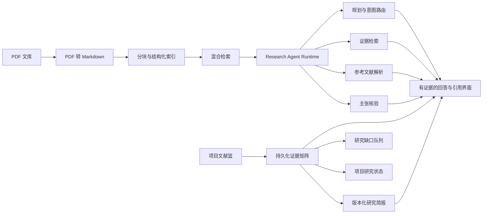

# Pi_zaya

[English](README.md) | 简体中文

Pi_zaya 是一个面向学术 PDF 的本地优先、证据可追溯研究助手。它可以把
PDF 转换为带页码和结构锚点的 Markdown，建立混合检索索引，回答论文问题，
展示可定位到原文的引用，并把项目文献篮进一步整理为证据矩阵、研究简报、
研究缺口队列和质量优先的下一步行动。

这不是只生成答案的 PDF 聊天演示。Pi_zaya 把 PDF 转换、结构化索引、检索、
Agent 规划、工具调用、主张核验、引用卡片和 React 追踪界面连接为一个完整的
研究工作流。

产品入口是 FastAPI + React。旧版 Streamlit 入口已经移除；不要使用
`app.py`、`streamlit run` 或端口 `8501` 启动产品。

## 下载 Windows 测试版

当前已发布测试版是
[`v0.1.0-beta.12`](https://github.com/LittlePyx/Pi_zaya/releases/tag/v0.1.0-beta.12)。

### 应该下载哪个文件

| Release 文件 | 用途 | 使用方法 |
|---|---|---|
| [`Pi_zaya-v0.1.0-beta.12-windows-x64-setup.exe`](https://github.com/LittlePyx/Pi_zaya/releases/download/v0.1.0-beta.12/Pi_zaya-v0.1.0-beta.12-windows-x64-setup.exe) | 推荐普通 Windows 用户使用 | 先核对 SHA-256，再运行安装向导。安装后从开始菜单或可选的桌面快捷方式打开 Pi_zaya。只安装到当前用户，不需要管理员权限。 |
| [`Pi_zaya-v0.1.0-beta.12-windows-x64.zip`](https://github.com/LittlePyx/Pi_zaya/releases/download/v0.1.0-beta.12/Pi_zaya-v0.1.0-beta.12-windows-x64.zip) | 免安装、移动目录或排查问题 | 先核对 SHA-256，把 ZIP **完整解压**到普通文件夹，再双击 `Pi_zaya.exe`。 |
| `*.sha256` | 校验下载是否完整 | 这是文本校验文件，不是软件。使用 `Get-FileHash` 计算对应 EXE 或 ZIP 的 SHA-256，并与文件中的值比较。 |
| `*.manifest.json` | 查看构建来源和签名状态 | 这是机器可读的版本、提交、许可证、包类型和签名记录，不是软件。 |
| GitHub 自动生成的 Source code 压缩包 | 开发者从源码构建 | 这不是可直接运行的 Windows 软件。普通用户请选择安装器或便携 ZIP。 |

安装版和便携版功能相同，都已包含 Python 运行时和构建好的 React 前端，
不要求用户安装 Python、Node.js 或 npm。启动后浏览器会打开本地页面，Pi_zaya
图标会留在系统托盘；托盘菜单可以重新打开页面、查看日志和数据目录并安全退出。

当前 Release 没有受信任的代码签名，因此 Windows 可能显示“未知发布者”。
请只从项目正式 GitHub Release 下载并先核对 SHA-256。只有 manifest 中
`signed` 为 `true`，并且 Windows 验证的发布者与发布说明一致时，才应视为
受信任签名版本。

更详细的安装、首次配置、更新、卸载和故障恢复步骤见
[Windows 中文使用说明](packaging/windows/README-中文.md)。

### 首次使用

1. 启动 Pi_zaya，浏览器会自动打开本地页面。
2. 按首次使用引导进入“设置”，填写文本模型 API Key。
3. 系统只会在能够可靠识别服务商时读取模型列表；普通 `sk-` Key 不会被发送
   给多家服务尝试。
4. 无法自动识别时，从下拉框选择 Qwen、DeepSeek、OpenAI 或自定义
   OpenAI 兼容服务，再选择模型或手动输入模型 ID。
5. 模型发现和连接测试都有短超时且不自动重试；网络不可用或模型不匹配时会
   回退到内置选项或手动输入，不会一直卡在加载状态。
6. 在“文库”导入 PDF，等待转换和索引完成，然后进入“问答”提出问题。
7. 点击回答中的引用，可在阅读器中定位原文证据。

AI 问答和研究工作流需要文本模型。复杂扫描件、公式和图片较多的论文建议另外
配置支持图片输入的 Qwen 视觉模型，以获得更好的 PDF 转换质量。

### 数据、更新和转换恢复

- 用户数据库、PDF、转换后的 Markdown、偏好、备份、运行状态和日志默认位于
  `%LOCALAPPDATA%\Pi_zaya`，与安装或解压目录分离。
- 安装版升级时先从托盘退出，再运行新版安装器。卸载程序只删除软件和快捷方式，
  不删除个人文库。
- 便携版升级时先退出，把新版 ZIP 解压到新的程序目录，再启动新版。
- 如果转换期间退出或后台异常结束，重启后任务会显示为已中断，不会一直显示
  “转换中”，也不会自动继续调用付费模型。
- 点击“继续转换”或“全部继续”后，软件会检查源 PDF 和视觉 API 配置，并复用
  已完成且校验有效的页面。源文件或 Key 缺失时会保留明确提示，不会无限重试。
- 自动更新尚未实现；当前版本应明确视为 beta，而不是正式稳定版。

## 主要能力

| 能力 | 作用 |
|---|---|
| 带锚点的 PDF 转换 | 转换为 Markdown，同时尽量保留页码标记、章节、图片、公式和原文定位信息。 |
| 可恢复转换任务 | 持久化排队和运行中的转换任务，重启后由用户明确继续，并复用已完成页面，不自动消费模型额度。 |
| 基于证据的问答 | 在本地索引中检索证据，构造 RAG 上下文并生成有来源约束的回答。 |
| 引用追踪 | 展示回答证据、来源卡片、参考文献上下文和阅读器定位目标。 |
| 项目文献篮 | 收集论文与摘录，维持项目研究上下文并导出引用。 |
| 证据矩阵 | 按项目和版本整理方法、实验、指标、结果与限制；有事实的单元格绑定同一论文的精确证据，缺失内容保持为空。 |
| 研究简报 | 只从已核验证据矩阵生成带版本和引用审计的简报，并支持受影响内容的增量更新。 |
| 研究缺口队列 | 汇总缺失证据、不可比较项、过期简报和来源变化，形成需要人工确认的优先工作列表。 |
| 项目研究状态 | 衡量来源新鲜度、矩阵核验、证据缺口、比较覆盖和简报血缘，只给出一个质量优先的下一步。 |
| Research Agent | 在现有 RAG 流程上增加规划、来源策略、工具轨迹、证据充分性和逐句引用支持核验。 |
| 质量工具 | 扫描转换质量、执行安全修复、重建索引并跟踪元数据和参考文献同步。 |

## 架构



整体数据流：

1. PDF 转换为保留页码和来源位置的 Markdown。
2. Markdown 被分块，并建立正文、参考文献、图片和阅读器导航索引。
3. 检索根据当前论文、文献篮或全库范围返回候选证据。
4. Research Agent 规划工具调用，判断证据是否充分，生成回答并核验引用支持。
5. 项目文献篮可生成持久化、版本化证据矩阵；已填事实必须来自同一论文并具有
   可定位证据。
6. 已核验矩阵可生成研究简报。矩阵变化后，系统只更新受影响的引用块，并保留
   历史核验和人工接受/保留决定。
7. 研究缺口与项目状态中心根据来源变化、证据缺陷、比较覆盖和简报血缘，路由到
   唯一的质量优先下一步，但不会替研究者自动接受证据结论。

主要后端入口：

- `api/main.py`：FastAPI 应用。
- `api/routers/chat.py`：聊天、消息和 Research Agent API。
- `api/routers/library.py`：文库、转换、质量、元数据和索引 API。
- `api/routers/evidence_matrices.py`：证据矩阵、版本、审计和导出。
- `api/routers/research_briefs.py`：研究简报、版本、证据审计和导出。
- `kb/task_runtime.py`：后台问答和转换运行时。
- `kb/evidence_matrix.py`、`kb/research_brief.py`：结构化研究产物与质量契约。

主要前端入口：

- `web/src/main.tsx`：React 入口。
- `web/src/pages/ChatPage.tsx`：问答工作区。
- `web/src/pages/LibraryPage.tsx`：PDF 和文库工作区。
- `web/src/components/chat/AgentTracePanel.tsx`：Agent 轨迹界面。
- `web/src/components/chat/EvidenceMatrixWorkspace.tsx`：证据矩阵工作区。
- `web/src/components/chat/ResearchBriefWorkspace.tsx`：研究简报工作区。

## Research Agent 模式

Research Agent 是现有 RAG 系统上的增量层，不替换检索、提示构造、引用卡片或
普通聊天。启用后，回答可以携带问题类型、查询范围、规划步骤、工具调用、证据
矩阵和逐句支持核验。主回答保持简洁，执行细节默认收起，需要时再展开检查。

来源组合会明确标记为本地证据、混合本地/外部、外部学术背景或普通模型回答。
本地证据不足时，系统会限定结论或在已配置条件下使用外部学术回退，不会把它
伪装为知识库已验证结果。回答质量门禁还会检查引用、来源披露、证据重叠和内部
轨迹泄漏；修复仍不合格时，返回保守的证据摘要。

在 React 问答输入框中切换 `Normal` / `Agent` 即可启用。设置按会话保存，只影响
之后发送的问题。没有文本模型 Key 时，Agent 仍可降级返回检索证据和轨迹，
不会导致应用崩溃。

## 从源码开发

本节只面向贡献者。使用 Windows 安装版或便携 ZIP 的用户不需要安装 Python、
Node.js 或 npm。

源码环境要求：

- Python `3.10.11`，见 `.python-version`。
- Node.js `24.13.0`，见 `.nvmrc`。
- 完整问答至少配置一个文本模型 Key：`QWEN_API_KEY`、
  `DEEPSEEK_API_KEY` 或 `OPENAI_API_KEY`。

安装依赖：

```powershell
Copy-Item .env.example .env

python -m venv .venv
.\.venv\Scripts\Activate.ps1
pip install -r requirements.txt

cd web
npm ci
cd ..
```

启动开发界面和 API：

```powershell
.\run_new.ps1 -StopExisting
```

也可以使用等价包装：

```powershell
.\run.ps1 -StopExisting
```

开发地址：

- React：`http://127.0.0.1:5173/`
- FastAPI：`http://127.0.0.1:8000/`

生产式单服务本地运行：

```powershell
cd web
npm run build
cd ..
python server.py
```

## 常用配置

- `QWEN_API_KEY`、`DEEPSEEK_API_KEY`、`OPENAI_API_KEY`：文本模型访问。
- `QWEN_BASE_URL`、`DEEPSEEK_BASE_URL`、`OPENAI_BASE_URL`：可选服务地址。
- `QWEN_TEXT_MODEL`、`QWEN_VISION_MODEL`：Qwen 文本和 PDF 视觉转换模型。
- `KB_PDF_DIR`：源 PDF 目录。
- `KB_MD_DIR`：转换后 Markdown 目录。
- `KB_DB_DIR`：检索和索引目录。
- `KB_CHAT_DB`：聊天 SQLite 路径。
- `KB_LIBRARY_DB`：文库 SQLite 路径。
- `KB_CROSSREF_BUDGET_S`：Crossref 同步时间预算。

开发环境可复制 `.env.example`，生产式部署才使用 `.env.production.example`。
设置界面也可把本地 API 偏好保存到 `user_prefs.json`；环境变量和 `.env` 优先。

## 典型研究流程

1. 打开“文库”，上传或选择 PDF。
2. 转换为 Markdown 并检查转换质量。
3. 必要时执行修复或重新转换，再重建知识库索引。
4. 在当前论文、文献篮或全库范围提问。
5. 从回答引用卡片进入阅读器，核对精确原文。
6. 把重要论文加入项目文献篮，生成并核验证据矩阵，缺失证据保持为空。
7. 从已审计矩阵生成研究简报；矩阵变化后复核受影响字段和引用。
8. 导出带血缘标记的简报，或将矩阵导出为 Markdown、CSV 或 XLSX。

## 质量与发布

项目维护后端单元和 sanity 测试、Ruff、研究问答回放、证据比较、项目旅程、
转换结构质量、前端 lint/build、浏览器 smoke、核心引用/阅读器回归和普通用户
界面隔离门禁。Windows 发布还必须通过无标签预检、嵌入式运行时打包、干净配置
启动、安装器覆盖升级、卸载、用户数据保留、校验和与签名声明检查。

评估维度和可复现命令见 [docs/EVAL_DASHBOARD.md](docs/EVAL_DASHBOARD.md)，
发布边界和历史验收见 [docs/RELEASE_RUNBOOK.md](docs/RELEASE_RUNBOOK.md)。文档不会
把未测量的数据写成性能结论。

## 本地数据文件

| 路径 | 用途 |
|---|---|
| `chat.sqlite3` | 会话、消息、引用和聊天元数据。 |
| `library.sqlite3` | 文库元数据、来源和转换任务记录。 |
| `db/` | 文档、分块、参考文献索引和 Crossref 缓存。 |
| `backups/` | 手动和自动备份。 |

这些运行数据不应提交到 Git。

## 开发注意事项

- 保留 Markdown 页码标记 `<!-- kb_page: N -->`。
- React API 契约应在 `web/src/api` 中保持类型化。
- 质量问题应优先在转换器、检索或数据流源头修复，不要只隐藏界面状态。
- 后台任务和共享状态必须保持线程安全。
- 高风险操作前先创建或验证备份。

## 开发与测试

- 开发：LittlePyx
- 测试：Izaya

## 许可证

Pi_zaya 使用 MIT License，完整条款见 [LICENSE](LICENSE)。
