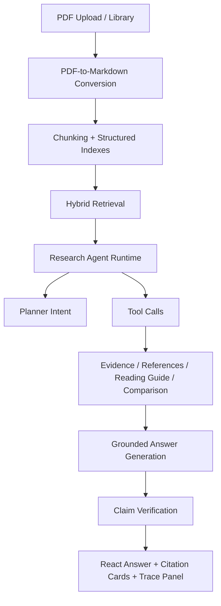

# Pi_zaya Portfolio Case Study

Pi_zaya is a local-first, evidence-grounded research agent for academic PDFs. It
was built to explore what a serious RAG research assistant needs beyond a basic
"upload PDF and chat" demo: source-aware conversion, scoped retrieval, citation
tracing, agent planning, trace observability, and honest evaluation.

## Why This Project Was Built

Academic reading workflows are messy. A useful assistant has to help with
paper-specific questions, multi-paper comparisons, upstream references, reading
plans, and citation follow-up without losing track of where each answer came
from. Pi_zaya was built around that constraint: answer quality is not only about
fluent generation, but also about whether a user can inspect the supporting
evidence.

## Core Technical Challenges

- PDF conversion must preserve enough structure for later retrieval and reader
  navigation: pages, headings, figures, formulas, and local anchors.
- Retrieval must respect user scope: current paper, selected literature basket,
  or full library.
- RAG answers must distinguish local paper evidence from general model or web
  background.
- Citation cards and reader locate targets must make answer claims inspectable.
- Agent traces must be useful for debugging without cluttering normal answers.
- Evaluation must avoid invented numbers and separate measured metrics from
  manual review targets.

## System Architecture

Backend responsibilities live primarily in FastAPI routers and `kb/*` modules.
The React frontend provides the chat workspace, reader, citation shelf, library
management, and collapsed Research Agent Trace panel.

## Agent Workflow

1. Classify the user task into a planner intent.
2. Generate a tool plan.
3. Retrieve local evidence under the selected scope.
4. Check retrieval confidence and evidence sufficiency.
5. Run specialized tools when relevant: references, reading guide, comparison.
6. Generate a concise answer using local evidence as the authority.
7. Verify sentence-level citation support.
8. Return the answer with an optional trace that records planner intent, tool
   calls, retrieval confidence, evidence status, and claim support.

The current implementation is deliberately conservative. It uses explainable
heuristics first and keeps degraded-mode behavior when LLM keys are missing.

## Evaluation Strategy

The evaluation story is split into measured checks and not-yet-measured targets.

Measured or semi-automated checks include:

- Unit tests for planner, trace schema, retrieval confidence, and verifier logic.
- Frontend lint/build/e2e smoke tests.
- Research Agent golden prompt validation.
- Agent trace schema validation.
- Recorded answer-quality fixture checks for source disclosure, expected answer
  points, local citation support, and no trace/tool/debug clutter in the main
  answer.
- Converter quality dry-run validation.

Metrics that should be tracked on labeled datasets, but are not claimed as
measured until a reproducible run exists:

- Retrieval Recall@k
- Citation precision
- Claim support rate
- Unsupported claim rate
- No-evidence refusal accuracy
- P50/P95 latency
- Cost per query when token usage is available

## What Makes It Different From A Basic RAG Demo

- Local-first document state instead of a hosted document service.
- Anchored PDF conversion and reader locate targets.
- Literature basket and scoped research context.
- Explicit Research Agent Mode with planner intent and tool traces.
- Source-aware answer generation that separates local evidence from external
  background.
- Claim-level verification summaries rather than only final text.
- Evaluation docs that mark unmeasured metrics as `TBD` instead of presenting
  fabricated benchmark numbers.

## How To Explain It In An Interview

Short version:

> Pi_zaya is a local-first research agent for academic PDFs. I built the system
> around evidence traceability: PDFs are converted into anchored Markdown,
> indexed for retrieval, routed through an agent planner, answered with local
> citations, and verified at the sentence level. The UI keeps normal answers
> clean while exposing an agent trace for debugging and review.

Deeper technical points:

- Discuss how PDF conversion quality affects downstream retrieval and citation
  reliability.
- Explain the difference between local evidence, external background, and
  no-evidence fallback.
- Walk through the trace object: planner intent, plan steps, tool calls,
  retrieval confidence, evidence status, and verification.
- Be explicit that semantic evaluation is still an ongoing area and that the
  repository separates deterministic fixture checks from future live benchmark
  metrics.

## Suggested GitHub Metadata

Suggested description:

> Local-first evidence-grounded research agent for academic PDFs with RAG,
> citation tracing, agent planning, and verifiable answers.

Suggested topics:

`ai-agent`, `rag`, `llm`, `research-agent`, `fastapi`, `react`, `typescript`,
`pdf-processing`, `citation-tracing`, `agent-observability`, `llm-evaluation`
